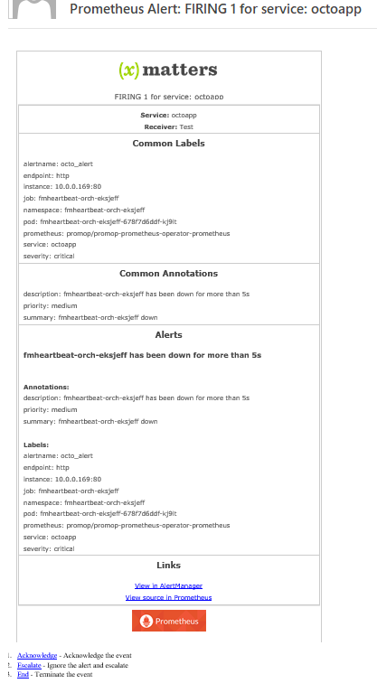

# Prometheus AlertManager
[Prometheus](https://prometheus.io/) is a powerful, open-source monitoring solution. This integration to xMatters extends the alerting capabilities of AlertManager to notify the right people at the right time. 

[](https://youtu.be/cBP7w_NhkBA)

---------

<kbd>
  
</kbd>

---------


# Pre-Requisites
* Prometheus with [AlertManager](https://github.com/prometheus/alertmanager) set up and running. 
* An application to monitor
* xMatters account - If you don't have one, [get one](https://www.xmatters.com)!

# Files
* [Prometheus.zip](Prometheus.zip) - Comm Plan for the integration builder script and notification form templates. 

# How it works
[Alert rules](https://prometheus.io/docs/alerting/rules/) are defined in Prometheus and sent to AlertManager for further processing. The AlertManager [config file](https://prometheus.io/docs/alerting/configuration/#configuration-file) defines what happens after the alerts are sent to AlertManager. A webhook points to an inbound integration endpoint and tied to a [`receiver`](https://prometheus.io/docs/alerting/configuration/#<receiver>), which can then be referenced by a [`route`](https://prometheus.io/docs/alerting/configuration/#<route>). Once the alert reaches xMatters, the integration builder script transforms the content and builds the event, sets the recipient to the receiver and creates the event. 

# Installation

## xMatters setup
1. Import the [Prometheus.zip](Prometheus.zip) comm plan. 
2. Click Edit > Integration Builder
3. Click `1 Configured` next to Inbound Integrations section. 
4. Click on the `Inbound from Prometheus` link
5. Scroll to the bottom (**How to trigger the integration** section) and select `URL Authentication` from the dropdown
6. Copy the endpoint at the bottom of the page (in the **Trigger** section). Save for later. 


## Prometheus setup
1. Open the `alertmanager.yml` file and navigate to the `receivers` section. The location of the file and the section will depend on the details of the installation. 
2. Add a new receiver with the following values:
    * `name`: the name of the xMatters group that will receive the event (the group must exist before events can be routed properly).
    * `url`: the url that was copied in step 6 of xMatters setup
    * `send_resolved`: set to true so that *resolved* alerts will be sent to xMatters
    
    For example, to target the `Database` group:

    ```yaml
    - name: 'Database'
      webhook_configs:
        - url: 'https://acme.xmatters.com/api/integration/1/functions/UUID/triggers?apiKey=KEY'
    send_resolved: true
    ```

3. Edit the route that should target the new receiver. For example, to notifiy this `Database` receiver for the `octoapp` service:

    ```yaml
      routes:
      - match_re:
          service: ^(octoapp)$
        receiver: Database
    ```

4. Repeat as needed for new routes and new receivers. 

5. Edit any alert rules (referenced in the file(s) defined in the `rule_files` section of the `prometheus.yml` file) to include a priority annotation (valid values are low, medium, and high), or to include any additional fields required for processing. 
    * Suggested alert properties:
        * Labels:
            * service
            * severity
        * Annotations:
            * description
            * priority
            * summary

    For example:
    
    ```
    alert: octo_alert
    expr: some_gauge > 30
    for: 1m
    labels: 
      service: "octoapp" # typically this label doesn't need to be set here because it will already exist on the prometheus target
      severity: "page_octo"
    annotations:
      summary: "A short description"
      description: "A more specific description of the alert"
      priority: "high"
      other_field: "other value"
    ```
    
       The fields inside the `ANNOTATIONS` section can then be referenced in the integration builder like so:
    ```javascript
    var other_field = data.commonAnnotations.other_field;
    ```

# Testing
Create or edit an Alert Rule in the alert rules file (defined in the `prometheus.yml` file) that is easy to fire. For example, to fire when the `widget_gauge` is greater than 30 for 1 minute:

```
alert: octo_alert
expr: widget_gauge > 30
for: 1m
labels: 
  service: octoapp
  annotations:
    summary: The summary goes here
    description: The description goes here
    priority: high
```

Then in the monitored application, get the `widget_gauge` value above 30 for 1 minute. This will trigger an alert in AlertManager, and then will be fired off to xMatters. Make sure you have a `Database` group with a user configured in xMatters. 

A notification will be sent out targeting the Database group:

<kbd>
  
</kbd>


# Troubleshooting
Check the AlertManager log (probably in `/var/log/prometheus`, but will depend on the installation details) for any errors making the call to xMatters. Then check the Activity Stream in the `Inbound from Prometheus` script for errors. 
Note that if the alertmanager configuration is not valid, alertmanager will fail to start. You can validate your configuration using `amtool check-config myconfig.yaml`. `amtool` is included with the [alertmanager release](https://prometheus.io/download/#alertmanager)

